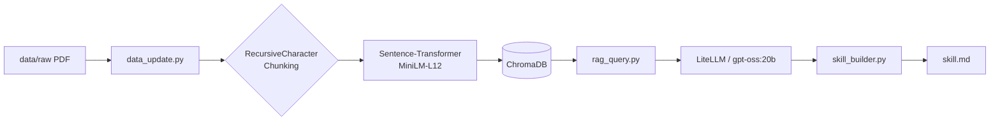

# Build-Your-Personal-RAG

## 1. 專案簡介
* **知識主題**：本專案聚焦於「2025 年 ACL 系列論文中關於同理心 (Empathy) 與價值對齊 (Value Alignment) 的研究」。
* **選擇理由**：隨著大型語言模型 (LLM) 的普及，如何讓模型展現人類般的同理心並符合人類價值觀（Value Alignment）是當前 NLP 領域的核心課題。
* **資料來源**：共涵蓋約 30 份從 ACL Anthology 獲取的論文，格式為 PDF。
* **技術選型**：
    * **LLM 接口**：使用 OpenAI SDK 介接校內 gpt-oss:20b 模型。
    * **向量資料庫**：ChromaDB (Persistent Mode)。
    * **嵌入模型**：paraphrase-multilingual-MiniLM-L12-v2。

## 2. 系統架構說明


## 3. 設計決策說明 (Design Decisions)

* **Chunking 策略**：
    * 採用 RecursiveCharacterTextSplitter。
    * **設定參數**：chunk_size=500, chunk_overlap=50。
    * **決策理由**：500 tokens 約為一個標準段落的大小，能保持語意完整；50 tokens 的重疊則確保段落間的銜接資訊不會遺失。
* **Embedding 模型選擇**：
    * 選用 paraphrase-multilingual-MiniLM-L12-v2。
    * **決策理由**：此多語系模型在語意對齊上表現優異，且體積適中，適合本地 CPU 環境。
* **Vector DB 選型**：
    * 選擇 **ChromaDB**。
    * **決策理由**：提供嵌入式存儲，無需透過 Docker 啟動服務，複現性最高且適合小型研究專案。
* **Retrieval 策略**：
    * **Top-k 設定**：預設為 3。
    * **決策理由**：在提供足夠脈絡與控制模型回應時間（Latency）之間取得最佳平衡，避免過長的 Context 導致推論超時。
* **Prompt Engineering**：
    * **設計邏輯**：強制要求模型根據參考資料回答，並列出引用來源。若資料不足則必須誠實回答「不知道」。
    * **決策理由**：有效抑制 LLM 產生幻覺（Hallucination）。
* **Idempotency 設計**：
    * **實作方式**：data_update.py 透過 --rebuild 參數確保冪等性。
    * **決策理由**：執行時若帶此參數，會清空舊目錄重新構建，確保索引與當前資料夾內容完全一致。

## 4. 環境設定與執行方式

### 4-1. Python 版本與虛擬環境
* 開發環境：**Python 3.13.0** (建議 Python >= 3.10)

```bash
    # ① 確認 Python 版本
    python3 --version

    # ② 建立並啟動虛擬環境
    python3 -m venv .venv
    source .venv/bin/activate  # macOS/Linux

    # ③ 安裝套件
    pip install -r requirements.txt

    # ④ 設定環境變數
    cp .env.example .env
```

### 4-2. Vector DB 啟動
本專案使用 **ChromaDB (Embedded Mode)**，無需啟動 Docker 容器。資料將儲存於專案目錄下的 chroma_db/。

### 4-3. 完整執行流程
```bash
    # ⑤ 全量重建索引
    python data_update.py --rebuild

    # ⑥ 測試 RAG 問答
    python rag_query.py --model gpt-oss:20b

    # ⑦ 生成 Skill 文件
    python skill_builder.py --output skill.md
```

## 5. 資料來源聲明 (Data Sources Statement)

| 來源名稱 | 類型 | 授權 / 合規依據 | 數量 |
| :--- | :--- | :--- | :--- |
| ACL Anthology  | PDF | CC BY 4.0 | 30 篇 |
