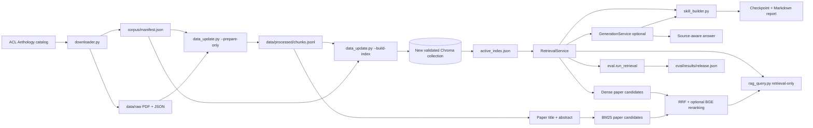

# RAG-based Research Agent Pipeline

A multilingual RAG research assistant for retrieving and synthesizing recent ACL papers on empathy, emotion recognition, and value alignment. The system provides deterministic corpus construction, provenance-aware indexing, hybrid retrieval, validated citation IDs, and reproducible evaluation.

這是 multilingual RAG research prototype，不是 production-ready service，也不提供回答正確性保證。

## 功能範圍

- 以固定規則取得 ACL Anthology 2025–2026 論文候選並下載 canonical 50-paper corpus。
- 使用 `pypdf` 逐頁擷取 PDF 全文，以 750-character chunks 和 100-character overlap 建立 deterministic chunks。
- 使用 `paraphrase-multilingual-MiniLM-L12-v2` 建立本機 ChromaDB index。
- 在沒有 LLM credential 的情況下執行 dense 或 paper-level hybrid retrieval-only 中英文查詢。
- 以 BM25、Reciprocal Rank Fusion 與 optional `BAAI/bge-reranker-v2-m3` 比較四組 retrieval configurations。
- 選擇性呼叫任意 OpenAI-compatible provider，並驗證回答中的 `[S#]` 是否存在於當次 source map。
- 產生含 index provenance、checkpoint及程式化source table的Markdown report。
- 以12題人工整理的小型evaluation set測量paper-level Recall@5、MRR@5與nDCG@5。

## Architecture and data flow


```mermaid
flowchart LR
    A[ACL Anthology catalog] --> B[downloader.py]
    B --> C[corpus/manifest.json]
    B --> D[data/raw PDF + JSON]
    C --> E[data_update.py --prepare-only]
    D --> E
    E --> F[data/processed/chunks.jsonl]
    F --> G[data_update.py --build-index]
    C --> G
    G --> H[(New validated Chroma collection)]
    H --> I[active_index.json]
    I --> J[RetrievalService]
    J --> K[rag_query.py retrieval-only]
    F --> R[Paper title + abstract]
    J --> S[Dense paper candidates]
    R --> T[BM25 paper candidates]
    S --> U[RRF + optional BGE reranking]
    T --> U
    U --> K
    J --> L[GenerationService optional]
    L --> M[Source-aware answer]
    J --> N[skill_builder.py]
    L --> N
    N --> O[Checkpoint + Markdown report]
    J --> P[eval.run_retrieval]
    P --> Q[eval/results/release.json]
```

重要模組：

| File | Responsibility |
|---|---|
| `config.py` | Typed、side-effect-free configuration與command-specific preflight |
| `corpus.py` | Corpus keyword matching、ranking與manifest models |
| `downloader.py` | ACL catalog讀取、安全PDF下載與manifest更新 |
| `documents.py` | Manifest-driven PDF extraction及deterministic page-local chunking |
| `data_update.py` | `--prepare-only`及safe full index rebuild entry point |
| `indexing.py` | Batched embedding、staging collection validation及active pointer更新 |
| `retrieval.py` | Active index validation與ordered retrieval results |
| `hybrid_retrieval.py` | Paper-level BM25、RRF、BGE reranking及selected-paper supporting chunks |
| `generation.py` | Optional OpenAI-compatible generation與citation-ID validation |
| `skill_builder.py` / `reporting.py` | Checkpointed report orchestration、atomic output及verified source table |
| `eval/run_retrieval.py` | Paper-level retrieval evaluation與machine-readable results |

## Requirements and installation

- Python 3.11或3.12。Python 3.13未驗證，也不在目前支援範圍。
- [`uv`](https://docs.astral.sh/uv/)。
- Corpus acquisition需要連線到ACL Anthology；首次index build可能需要下載embedding model，首次BGE reranking也需要下載約2.3 GB的reranker model。
- Retrieval-only不需要LLM credential。
- Answer及report generation才需要使用者提供OpenAI-compatible endpoint與key。

```bash
git clone <repository-url>
cd RAG-based-Research-Agent-Pipeline
uv sync --locked --all-groups
cp .env.example .env
```

所有relative paths均以project root解析。Runtime PDFs、chunks、ChromaDB、model caches、checkpoints、ordinary reports與`.env`皆由Git忽略。

## Configuration

Provider-neutral LLM設定如下；不執行generation時可全部留空：

```env
LLM_BASE_URL=
LLM_API_KEY=
LLM_MODEL=
```

Groq只是OpenAI-compatible設定範例，不是application logic的硬編碼依賴：

```env
LLM_BASE_URL=https://api.groq.com/openai/v1
LLM_API_KEY=
LLM_MODEL=openai/gpt-oss-20b
```

Provider availability、free tier、model名稱、endpoint與rate limits都可能改變；使用前應確認provider目前的官方文件。不要commit真實API key。CI不讀取`.env`，也不接收provider credentials。

可用的path/model overrides列於`.env.example`，包括`RAW_DATA_DIR`、`PROCESSED_DATA_DIR`、`CORPUS_MANIFEST_PATH`、`ACL_ANTHOLOGY_REPO_DIR`、`CHROMA_PERSIST_DIR`、`CHROMA_COLLECTION`、`EMBEDDING_MODEL`、`RERANKER_MODEL`與`REPORT_CHECKPOINT_PATH`。

## Corpus acquisition

Canonical corpus由tracked `corpus/manifest.json`定義，共50篇：2025年21篇、2026年29篇，來源不限定單一venue。

首次selection會：

1. 僅保留`2025 <= paper.year <= 2026`。
2. 對normalized title與abstract比對明確keyword phrases。
3. 使用`2 × title keyword matches + abstract keyword matches`計分。
4. 依score descending、year descending、Anthology paper ID ascending排序。
5. 去除重複paper IDs並選取前50篇。若不足50篇則停止，不會放寬keywords。

Standalone `value`、`alignment`與`sentiment`不是selection keywords。Manifest建立後，其固定paper IDs不會因catalog新增項目而被自動替換。

```bash
uv run python downloader.py
```

Downloader設定HTTP timeout、檢查successful status與`%PDF-`signature，並以temporary file加atomic replace寫入。既有valid PDF不會被覆寫。輸出中的`selected`、`downloaded`、`already existing`及`failed`是分開計數；failed項目不會被算成成功PDF。

Manifest是paper identity的canonical source。Ignored JSON sidecar保存經paper ID核對的abstract，但不是identity authority。

## PDF preparation

Initial release只支援manifest所列PDF及其associated JSON metadata，不支援standalone Markdown或TXT ingestion。

```bash
uv run python data_update.py --prepare-only
```

此命令：

- 只處理fixed manifest中的50篇PDF。
- 使用`pypdf`逐頁擷取全文，不做複雜References移除或OCR。
- 每頁獨立使用`chunk_size = 750`、`chunk_overlap = 100`；單位是characters，不是tokens。
- 保存paper ID、title、year、venue、URL、page、chunk index、PDF hash與chunk hash。
- 將deterministic chunks atomic寫入ignored `data/processed/chunks.jsonl`。
- 不載入embedding model、ChromaDB或LLM client。

目前release artifacts驗證的結果為50篇parsed papers、866 pages及5,398 chunks。

## Safe full index rebuild

```bash
uv run python data_update.py --build-index
```

此命令只讀取`data/processed/chunks.jsonl`，以batch方式產生embeddings並建立新的Chroma collection，不會原地修改active collection。新collection必須通過chunk count、unique IDs、50-paper coverage、embedding dimension與sample read-back驗證，之後才會atomic更新ignored `index_manifest.json`及`active_index.json`。失敗時既有active pointer不變；舊validated collections不會自動刪除。

目前active index含50篇、5,398 chunks及384-dimensional embeddings。現有index manifest沒有保存build duration，因此release results不宣稱該數值。

## Retrieval-only

```bash
uv run python rag_query.py --query "How can multimodal dialogue emotion recognition be improved?" --top-k 5 --retrieval-only

uv run python rag_query.py --query "大型語言模型如何進行價值對齊？" --top-k 5 --retrieval-only --json

uv run python rag_query.py --query "大型語言模型如何進行價值對齊？" --top-k 5 --retrieval-only --retrieval-config hybrid-rerank
```

Retrieval會驗證active pointer、index manifest、collection identity、count、embedding model及dimension，而且只呼叫`get_collection()`，不會靜默建立空collection。結果保持Chroma順序，包含rank、`[S#]`、distance、chunk ID、paper metadata、page、URL與passage text。Distance不是accuracy或calibrated probability。

`--retrieval-config`可選`dense`（default）、`dense-dedup`、`hybrid`與`hybrid-rerank`。後三者先以20個dense chunks形成paper candidates；hybrid另取BM25正分的前20篇並用RRF融合，沒有BM25正分時直接沿用dense paper ranking。Rerank模式只在需要時lazy載入BGE，對RRF前20篇的`query`與截斷後`title + abstract`配對評分。最後選5篇unique papers，再從每篇各取一個最佳dense supporting chunk並依paper order配置`[S1]`至`[S5]`。此選項只作用於retrieval-only；generation與report仍維持原dense流程。

## Optional answer generation

設定`LLM_*`後執行：

```bash
uv run python rag_query.py --query "How can multimodal dialogue emotion recognition be improved?" --top-k 5
```

Generation prompt將retrieved documents視為untrusted evidence，要求模型只依context回答、使用提供的`[S#]`、忽略document內的instructions，並在資料不足時明確說明。程式會列出valid及invalid source IDs，只從verified retrieval metadata回傳cited source資料。

Citation-ID validation只能確認某個ID存在於當次source map；它不能證明claim受到該passage支持，也不能證明回答事實正確。Conversation history只保留在目前process，retrieval仍使用current query，不做query rewriting或persistent history。

## Report generation

```bash
uv run python skill_builder.py --output reports/research_report.md
```

Report workflow保留四個固定research questions，共用retrieval及generation services。Checkpoint包含schema version、completed question IDs及active index identity；corrupt或identity mismatch的checkpoint會被拒絕。Checkpoint與final Markdown均以temporary file加replace寫入。

每個section必須至少有一個valid citation且不得含unknown source ID。Source References table只由verified retrieval metadata程式化產生，LLM不能提供table中的paper ID、title或URL。Ordinary reports預設寫入ignored `reports/`。

Tracked範例為[`examples/sample_report.md`](examples/sample_report.md)。它記錄corpus manifest hash、index identity、embedding及generation model；範例中的citation IDs已通過source-map validation，但內容未經獨立claim-level fact checking。

## Tests and CI

```bash
uv run ruff check .
uv run ruff format --check .
uv run pytest
```

Automated tests使用mocked/fake HTTP、embedding、vector-store及LLM dependencies。Fake-client tests是software tests，不是answer-quality證據。Tests不需要ACL network、paper/model downloads、real ChromaDB或API key。

GitHub Actions在push至`main`及targeting `main`的pull requests上執行Python 3.11與3.12 matrix。每個job只執行locked dependency installation、Ruff及offline `pytest`；首次GitHub結果仍須在workflow push後確認。

## Retrieval evaluation

Evaluation set位於[`eval/queries.jsonl`](eval/queries.jsonl)，包含12題中文cross-language、English topic、exact lookup、multiple-relevant及out-of-scope queries。其中11題具有owner-labeled gold relevance，第12題是沒有gold IDs的out-of-scope case。Judgments只依manifest titles與sidecar abstracts人工整理，沒有使用LLM judge，也沒有為relevance逐篇獨立閱讀全文。

Runner比較四組paper-level設定：A為前5個dense chunks（重複paper會占名額）；B從20個dense chunks取前5篇unique papers；C融合dense-20與positive-score BM25-20；D再以BGE rerank融合後的前20篇。A保留原MiniLM dense baseline。

```bash
uv run python -m eval.run_retrieval --output eval/results/release.json
```

Runner將overall、English-only及Chinese-only的Recall@5、MRR@5、nDCG@5分開輸出，並區分cold-start setup與resources載入後的warmed average query latency。Aggregate metrics只計算11題具有non-empty owner labels的queries；latency則涵蓋全部12題。Out-of-scope query保存實際rankings，但三個metrics為`null`且不納入macro average。

完整四組per-query rankings、distances、runtime、corpus/index identities及ingestion statistics會寫入tracked [`eval/results/release.json`](eval/results/release.json)；不包含full chunks或secrets。Gold relevance本身由title/abstract整理，因此D同樣使用title/abstract rerank可能帶來評估偏差；結果不能外推為一般RAG品質、groundedness或generation品質。

## Reproducibility and tracked artifacts

應追蹤：

- `corpus/manifest.json`
- `eval/queries.jsonl`
- `eval/results/release.json`
- `examples/sample_report.md`
- Source、tests、`pyproject.toml`及`uv.lock`

不應追蹤：`.env`、PDFs、sidecar JSON、processed JSONL、ChromaDB、model cache、checkpoints及ordinary reports。

## Limitations

- Corpus只有50篇，受2025–2026、keyword policy及固定selection影響；不代表ACL Anthology完整研究版圖。
- Relevance judgments只根據titles/abstracts人工整理，規模小且沒有independent assessors。
- `pypdf` extraction不支援OCR、layout-aware parsing、table reconstruction或scanned PDFs。
- Character chunking可能切斷語意；目前沒有token-aware chunking實驗。
- Retrieval只有dense embeddings，沒有hybrid search、reranking或query rewriting。
- Out-of-scope query仍會得到nearest-neighbor passages；目前沒有abstention threshold。
- Citation validation只檢查source ID membership，不測量claim-level correctness或groundedness。
- Optional generation依賴外部provider，其availability、model behavior、rate limits與價格不可由本repository保證。
- 專案沒有HTTP API、authentication、多使用者隔離、persistent conversation history、cloud deployment或production monitoring。

## Future Work

初始release之外可能考慮：incremental indexing、hybrid retrieval、reranking、token-aware chunking、OCR/layout-aware parsing、persistent multi-user history、FastAPI、Docker、authentication、cloud deployment、hosted vector databases、streaming及明確標示為optional experiment的LLM-as-judge。這些項目目前均未實作。
