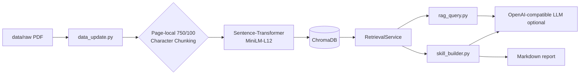

# Build-Your-Personal-RAG

## 1. 專案簡介
* **知識主題**：本專案聚焦於「ACL Anthology 2025–2026 年論文中關於同理心 (Empathy)、情緒理解與價值對齊 (Value Alignment) 的研究」。
* **選擇理由**：隨著大型語言模型 (LLM) 的普及，如何讓模型展現人類般的同理心並符合人類價值觀（Value Alignment）是當前 NLP 領域的核心課題。
* **資料來源**：固定 corpus manifest 定義 50 份從 ACL Anthology 選出的論文，格式為 PDF。
* **技術選型**：
    * **LLM 接口**：可選擇使用 OpenAI SDK 介接使用者設定的 OpenAI-compatible provider。
    * **向量資料庫**：ChromaDB (Persistent Mode)。
    * **嵌入模型**：paraphrase-multilingual-MiniLM-L12-v2。

## 2. 系統架構說明

```mermaid
graph LR
    A[data/raw PDF] --> B[data_update.py]
    B --> C{Page-local 750/100\nCharacter Chunking}
    C --> D[Sentence-Transformer\nMiniLM-L12]
    D --> E[(ChromaDB)]
    E --> F[RetrievalService]
    F --> G[rag_query.py]
    F --> H[skill_builder.py]
    G --> I[OpenAI-compatible LLM optional]
    H --> I
    H --> J[Markdown report]
```

## 3. 設計決策說明 (Design Decisions)

* **Chunking 策略**：
    * PDF 逐頁獨立切分，不讓 chunk 跨越 page boundary。
    * **設定參數**：chunk_size=750, chunk_overlap=100，單位皆為 characters。
    * **決策理由**：固定 character windows 與 overlap 可產生可重現的 chunk boundaries。
* **Embedding 模型選擇**：
    * 選用 paraphrase-multilingual-MiniLM-L12-v2。
    * **決策理由**：此多語系模型在語意對齊上表現優異，且體積適中，適合本地 CPU 環境。
* **Vector DB 選型**：
    * 選擇 **ChromaDB**。
    * **決策理由**：提供嵌入式存儲，無需透過 Docker 啟動服務，複現性最高且適合小型研究專案。
* **Retrieval 策略**：
    * **Top-k 設定**：預設為 3。
    * **決策理由**：在提供足夠脈絡與控制模型回應時間（Latency）之間取得最佳平衡，避免過長的 Context 導致推論超時。
* **Prompt Engineering**：
    * **設計邏輯**：強制要求模型根據參考資料回答，並列出引用來源。若資料不足則必須誠實回答「不知道」。
    * **決策理由**：有效抑制 LLM 產生幻覺（Hallucination）。
* **Idempotency 設計**：
    * **實作方式**：`--build-index` 每次建立新的 Chroma collection，完整驗證後才 atomic 更新 active pointer。
    * **決策理由**：build 或 validation 失敗時保留先前 active collection；舊 validated collections 不會自動刪除。

## 4. 環境設定與執行方式

### 4-1. Python 版本與虛擬環境
* `pyproject.toml` 目前限定 **Python 3.11–3.12**；正式支援聲明仍需在後續 CI matrix 完成驗證。Python 3.13 不在目前範圍內。

```bash
# ① 確認 Python 與 uv 版本
python3 --version
uv --version

# ② 依 uv.lock 安裝 runtime 與 development dependencies
uv sync --locked --all-groups

# ③ 建立本機設定檔（不得提交真實 API key）
cp .env.example .env
```

Corpus acquisition、ingestion、indexing 與 retrieval-only 查詢不需要 LLM credentials。目前的回答與報告生成則需要在 `.env` 設定 provider-neutral 的 `LLM_BASE_URL`、`LLM_API_KEY` 與 `LLM_MODEL`。Groq 可作為 OpenAI-compatible provider 的範例，但 application logic 不依賴 Groq；endpoint、model availability、free tier 與 rate limits 可能變動，使用前請查閱 provider 的最新官方文件。

所有相對路徑均以 project root 解析，而不是呼叫命令時的 current working directory。

### 4-2. Vector DB 啟動
本專案使用 **ChromaDB (Embedded Mode)**，無需啟動 Docker 容器。資料將儲存於專案目錄下的 chroma_db/。

### 4-3. 完整執行流程
```bash
# ④ 下載原始資料
uv run python downloader.py

# ⑤ 解析 manifest 中的 PDF 並產生 structured chunks（不載入 embedding/ChromaDB）
uv run python data_update.py --prepare-only

# ⑥ 建立並驗證新的 Chroma collection，成功後切換 active pointer
uv run python data_update.py --build-index

# ⑦ Retrieval-only 查詢（不需要 LLM_*；可加 --json 取得 JSON）
uv run python rag_query.py --query "your question" --top-k 5 --retrieval-only

# ⑧ 產生帶有 validated source IDs 的回答（需要 LLM_* 設定）
uv run python rag_query.py --query "your question" --top-k 5

# ⑨ 生成 checkpointed Markdown research report（需要 LLM_* 設定）
uv run python skill_builder.py --output reports/research_report.md
```

`--prepare-only` 僅處理 fixed manifest 的 50 份 PDF，逐頁使用 `pypdf` 擷取全文並將 provenance-rich chunks 原子寫入 Git-ignored 的 `data/processed/chunks.jsonl`。摘要輸出會分別列出 selected、parsed、failed、empty、pages 與 chunks；此命令不需要 embedding model、ChromaDB 或 LLM credentials。

`--build-index` 僅以 `data/processed/chunks.jsonl` 為輸入，分批建立新的 Chroma collection。Collection count、paper coverage、embedding dimension 與 sample readability 全部驗證成功後，才會更新 `chroma_db/index_manifest.json` 與 `chroma_db/active_index.json`；失敗不會切換 active collection，舊 collections 也不會自動刪除。此命令使用設定的 embedding model，但不需要 LLM credentials。

`--retrieval-only` 只會開啟 active pointer 指定的既有 collection，不會建立空 collection 或初始化 LLM client。結果依 Chroma 回傳順序列出 `[S1]`、`[S2]` 等 response-level source IDs，以及明確標為 distance 的距離值、paper/chunk provenance 與 passage text；distance 不是 accuracy。加上 `--json` 可輸出相同欄位的 JSON array。

未指定 `--retrieval-only` 時，程式會透過 provider-neutral `LLM_*` 設定呼叫 OpenAI-compatible provider，並要求回答只引用當次 retrieved context 中的 `[S#]`。程式會分別回報 valid 與 invalid source IDs，且只依 verified retrieval metadata 列出 cited papers；ID validation 僅表示引用存在於當次 source map，不代表回答內容必然正確。

`skill_builder.py` 直接共用 retrieval 與 generation services。四個既有 report questions 的 completed IDs 與 active index identity 會原子寫入 ignored checkpoint；stale/corrupt checkpoint 會被拒絕。最終 Markdown 亦以 temporary file 加 replace 寫入，Source References table 由 verified metadata 程式化產生，而非交由 LLM 撰寫。一般報告預設輸出至 ignored 的 `reports/`；既有 tracked `skill.md` 將留到後續文件整理階段處理。

#### Downloader 行為

`downloader.py` 搜尋 ACL Anthology 中符合 `2025 <= paper.year <= 2026` 的所有 venue，對 normalized title 與 abstract 進行指定 keyword matching。Ranking score 為 `2 × title keyword matches + abstract keyword matches`，再依 score descending、year descending、Anthology paper ID ascending 排序並選出固定 top 50 unique paper IDs。Standalone `value`、`alignment` 與 `sentiment` 不屬於 keywords。

Canonical manifest 首次寫入 `corpus/manifest.json` 後即固定 paper IDs；後續執行仍會取得 catalog 並報告 matched count，但不會因 catalog 新增項目而替換 fixed selection。下載的 PDF 與 associated JSON metadata 寫入 `data/raw/` 並由 Git 忽略。若首次選擇時 matched papers 少於 50，命令會停止，不會放寬條件。

執行摘要中的 `selected` 固定表示 manifest 的 50 篇論文；`downloaded` 是本次成功下載且通過 PDF signature 驗證的數量；`already existing` 是無須重複下載的既有有效 PDF；`failed` 是 HTTP 或內容驗證失敗的數量，且不會被計入成功下載。

## 5. 資料來源聲明 (Data Sources Statement)

| 來源名稱 | 類型 | 授權 / 合規依據 | 數量 |
| :--- | :--- | :--- | :--- |
| ACL Anthology  | PDF | CC BY 4.0 | 固定 manifest 50 篇 |
